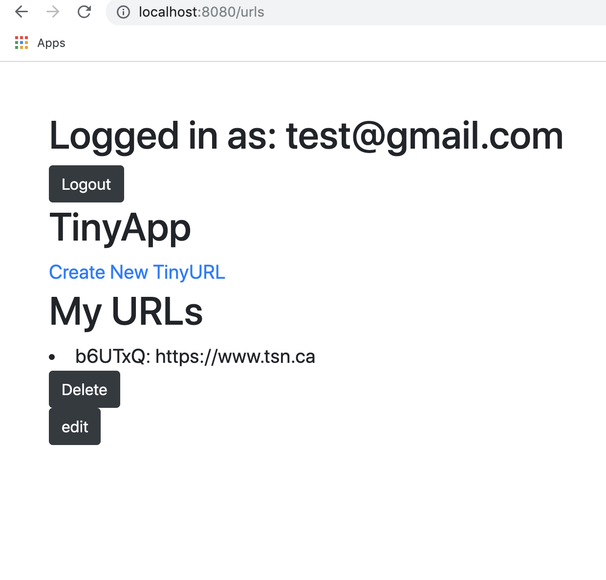

# TinyApp Project
> TinyApp is a full stack web application built with Node and Express that allows users to shorten long URLS

## Test Cases

I have tested all the cases multiple times and believe that the app works the way it is suppose to.

## Usage example

For people that like to tweet out multiple links or maybe perhaps you have a really long URL that you would like to shorten.

## Dependanices

    "bcrypt": "2.0.0",
    "body-parser": "^1.18.3",
    "cookie-session": "^1.3.3",
    "ejs": "^2.6.1",
    "express": "^4.16.4",
    "nodemon": "^1.18.11",
    "path": "^0.12.7"

## Development setup

    install the dependancies above
    then run the file using nodemon with the command npx nodemon app.js

## Final Product

